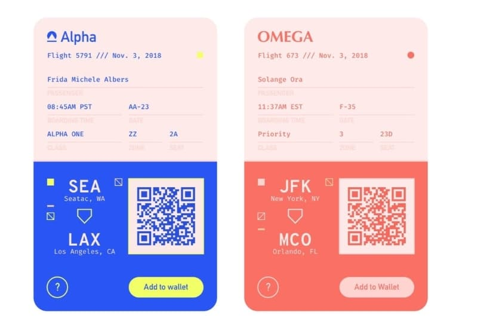

# Flight Tickets Redesigned

A React-based design project to recreate styled flight tickets, with added animation.

## Objectives

- Given a pre-existing image (the one seen above), recreate the design as best as possible through react.
- Add animation features to improve the client-facing experience.

## Process

- Using image editing software, establish and define how many and what kind of colors were used.
- Using Google Fonts, establish and define how many and what kind of fonts were used.
- Using image editing software, recreate icons and QR codes.
